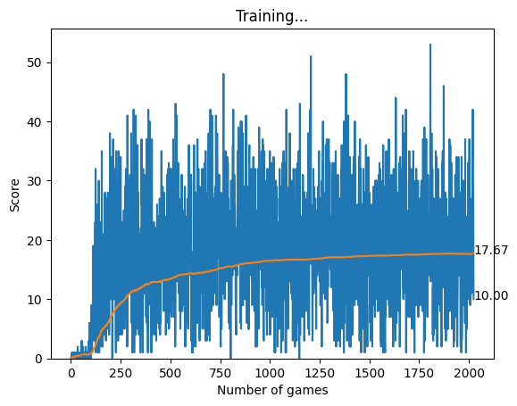

# SnakeGameAI
reinforcement learning on python game Snake

learning model from - https://youtu.be/L8ypSXwyBds?t=4270

Snake Game from github - https://github.com/patrickloeber/python-fun/tree/master/snake-pygame

to launch the model, run the agent.ipynb file

image output 1 of the model:
rewards for food = 10
losses for collisions = -10
    
    ```python
        rewards = 10
        losses = -10
    ```


-------------------------------------

image output 2 of the model:
rewards for food = 10
losses for wall collisions = -11
losses for self collisions = -13
    
        ```python
            rewards = 10
            wall_losses = -11
            self_losses = -13
        ```


-------------------------------------

image output 3 of the model:
rewards for food = 10
losses for wall collisions = -15
additional time penalty = -1
    
        ```python
            rewards = 10
            wall_losses = -15
            time_penalty = -1
        ```


-------------------------------------

The snake always ends up colliding with itself, even though the model is trained to avoid self-collisions.

# Idea for future development:

- add loss for eating food before threshold of x moves
- add time penalty starting at threshold of y moves

To create a window of time for the snake to eat food before it starts losing points for taking too long to eat the food. This could be a way to encourage the snake not to Bline towards the food and instead take a more strategic approach to eating the food, without getting stuck in a loop.

